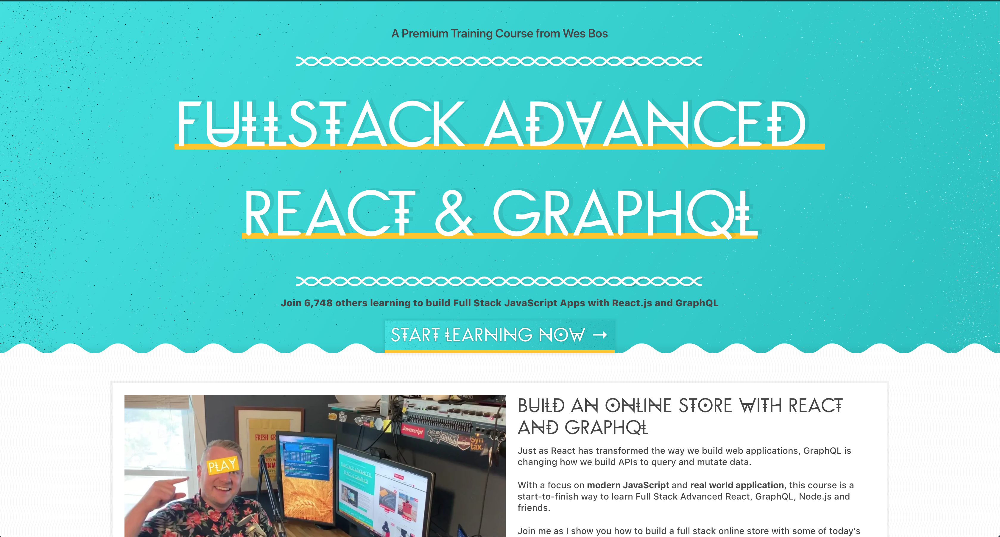

Over the weekend I got stuck into Wes Bos' latest course on Advanced React & GraphQL which I've been eagerly awaiting! I've done lessons 1-12 so far so I'm just about to get into the guts of it after setting up all the various parts of the application.

A part of the course I am particularly looking forward to is introducing user authentication and seeing how this ties in with GraphQL.

I was also happy to learn about a cool little library I hadn't heard of before called [NProgress](http://ricostacruz.com/nprogress/) which provides a nice simple progress bar for page transitions - a nice way to show the user something is happening, especially if they are on a slow network.

Keep up with my progress on [Github](https://github.com/jrp90/advanced-react-course) :)
