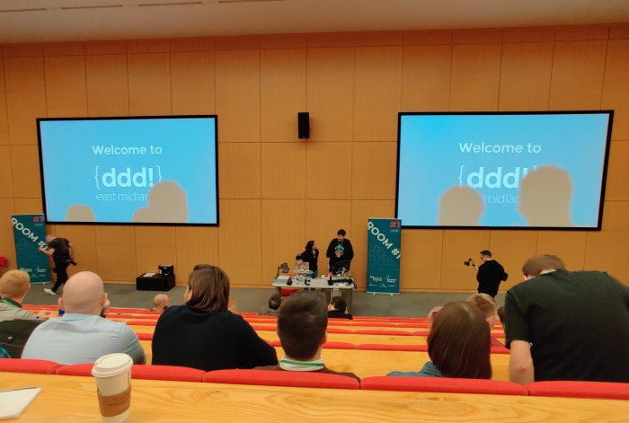
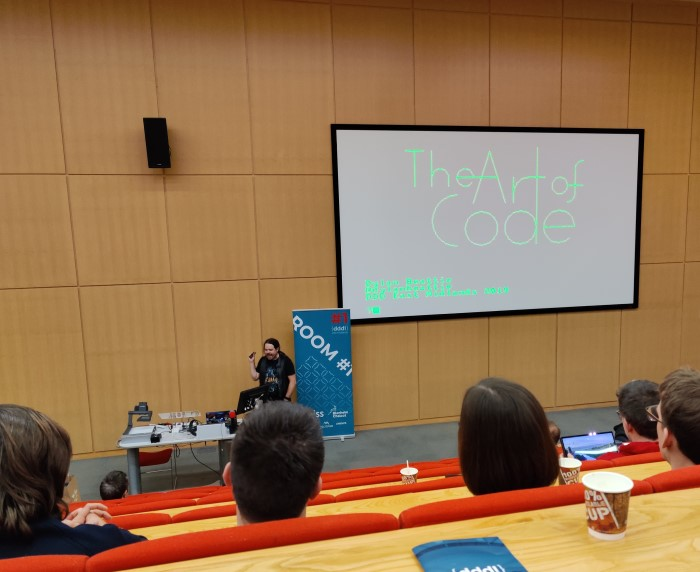
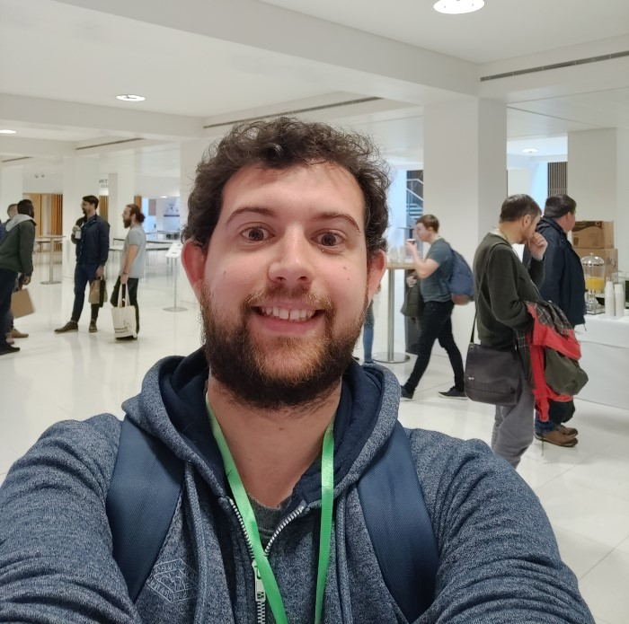

I had a great time at DDD East Midlands this weekend listening to some interesting talks and catching up with folks from the ever-enthusiastic east midlands tech community.

There was a fantastic opening talk from @dylanbeattie featuring a live song performance of the lyrics/code to a FizzBuzz solution written in Rockstar (a computer programming language designed for creating programs that are also hair metal power ballads). I'd recommend watching this one when the videos come out!

It was a shame about the fire alarms interrupting the day and being out in the rain for a while but the organisers had things back on track as soon as possible. I enjoyed more talks in the afternoon including Draw UX from Cara Holland and Think like a hacker from Matt Brunt.

All in all, it was a really well-organised event, so I just wanted to share a few pictures and say thanks again to the organisers, speakers and sponsors for a great day. 

The Art of Code talk from Dylan Beattie

Me with a cheesy grin

Old Market Square and Council House on the way home