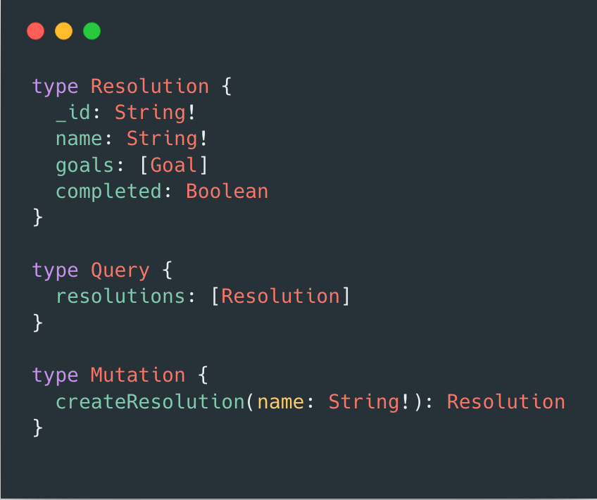

This past week I have been catching up on the backlog of [Syntax.fm](https://syntax.fm/) podcast episodes I had missed and would definitely recommend giving it a listen if you're into podcasts and web dev. It's from Wes Bos and Scott Tolinski who both create online courses for teaching all things web development.

I've been listening mainly on my commute to and from work and it's great to pick up tips and tricks (or tasty treats as they would say!) and generally keep abreast of what's going on in the industry, a must when working as a developer.

*Coding along some Graphql schemas from Scott Tolinski's course*

I hadn't previously heard of Scott Tolinski but have just completed his free course [Full-stack GraphQL with Apollo, Meteor & React](https://www.leveluptutorials.com/tutorials/full-stack-graphql-with-apollo-meteor-and-react) and found it was a great introduction to Graphql, which I've been meaning to learn for a while now.

I'm looking forward to Wes Bos bringing out his next course which will go over Graphql too, but in the meantime, I'll be reading some more of the Apollo docs and trying to use it in a project of my own.