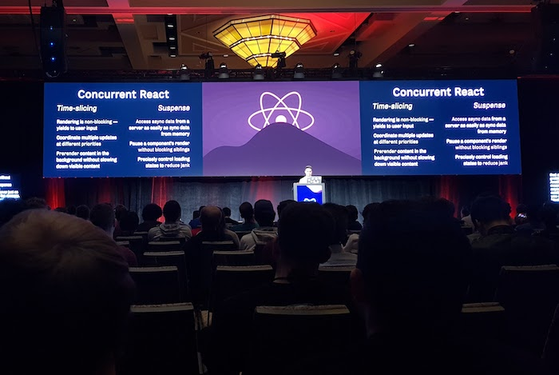
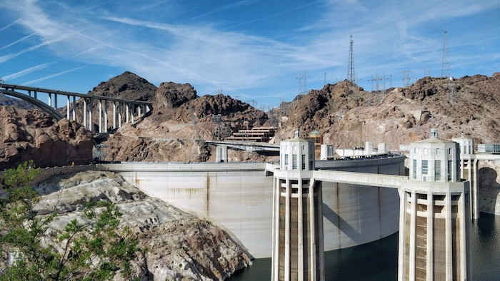
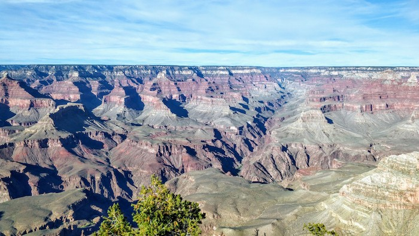
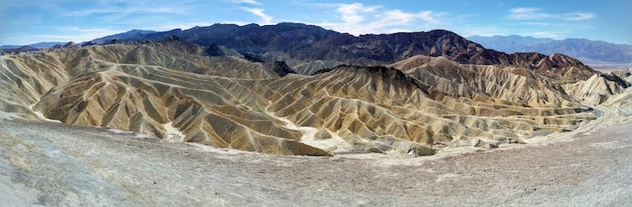
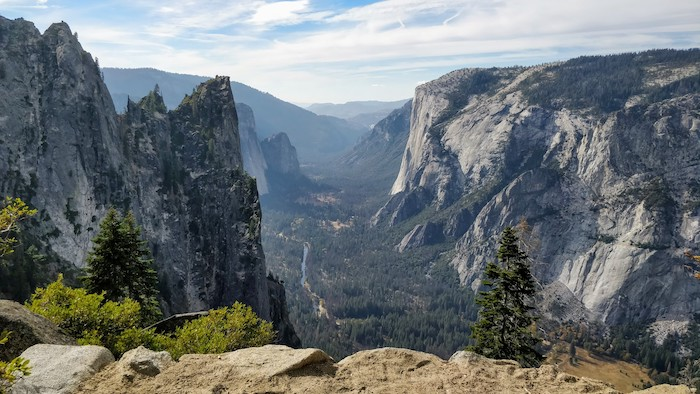
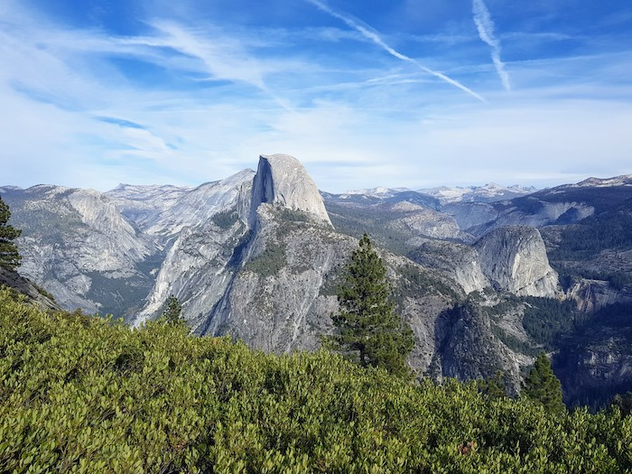
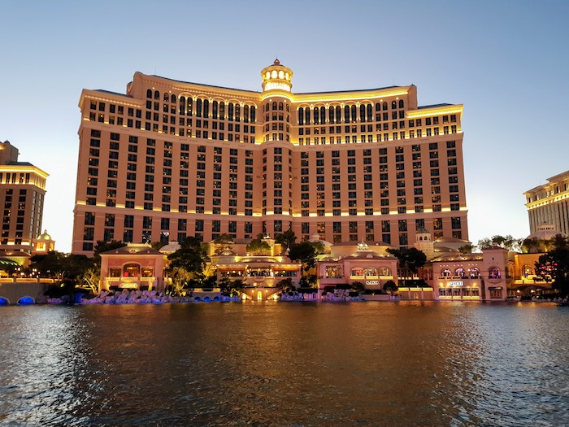

Looking back on React Conf at the end of last month I can definitely say it's the best conference I've been to. The talks, pacing, food, people and location were all great. I wanted to share a few more highlights I had from day two and some pictures from the short, but jam-packed, sightseeing trip afterwards!

- **Concurrent React** - The talks introducing and getting started using the new features of Concurrent React, including the new `lazy` and `Suspense` APIs, were very interesting. Another thing to add to the list of new things to learn!
- **React Profiler** - Another talk introduced the new React Profiler included in the React Developer Tools, which looks like a great tool to help measure and improve the performance of a React site.

After the conference, my friend [Jack](https://twitter.com/silverlight513) and I
did a lot of driving over the following days and saw some amazing sights.

The first day we took a trip to the south rim of the Grand Canyon via Hoover Dam

Grand Canyon South Rim

The next few days we went to Yosemite via Death Valley

A view back on Yosemite Valley during our hike on "4 Mile Trail"

A view of Half Dome from Glacier Point in Yosemite National Park.

...And finally, a night in Vegas walking the Strip
