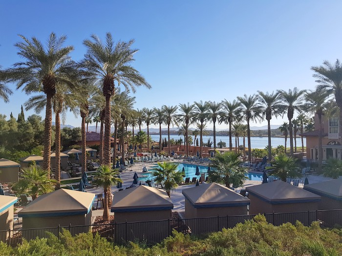
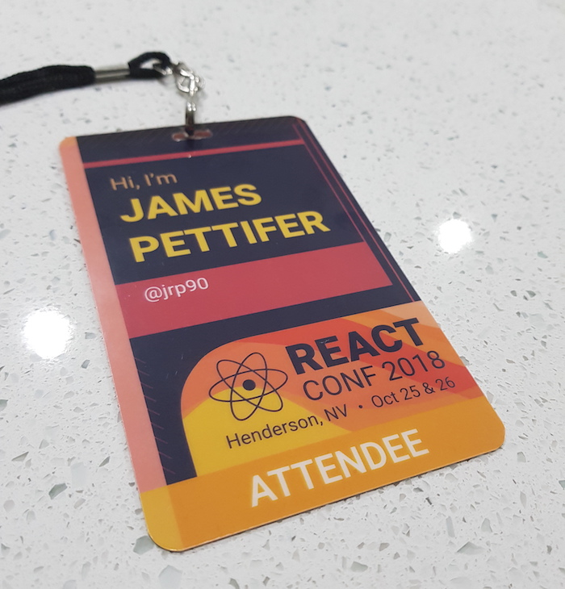
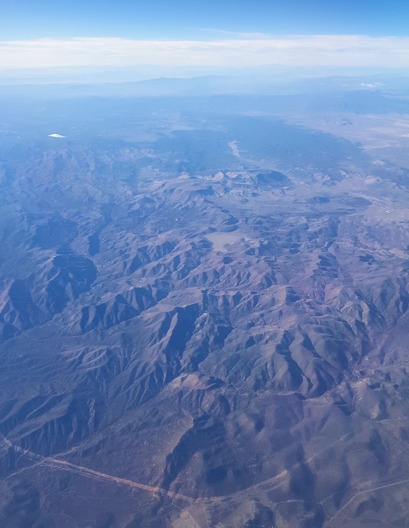
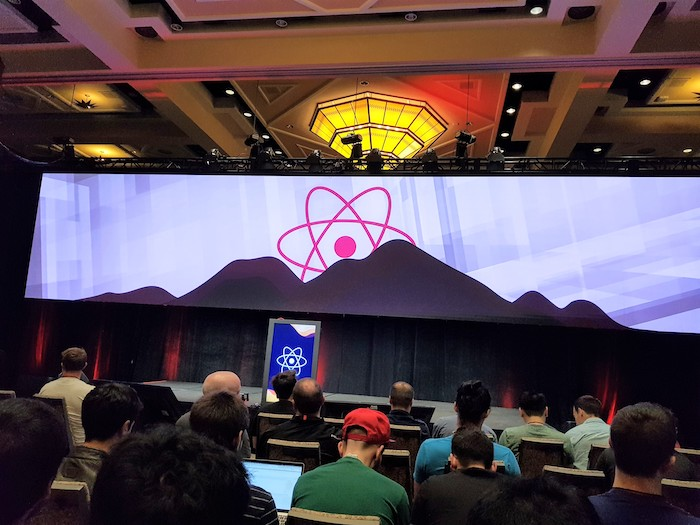
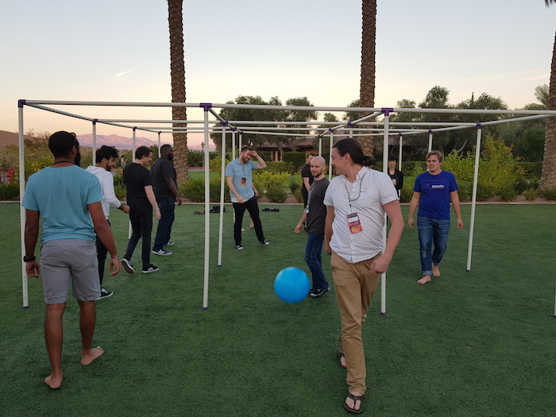
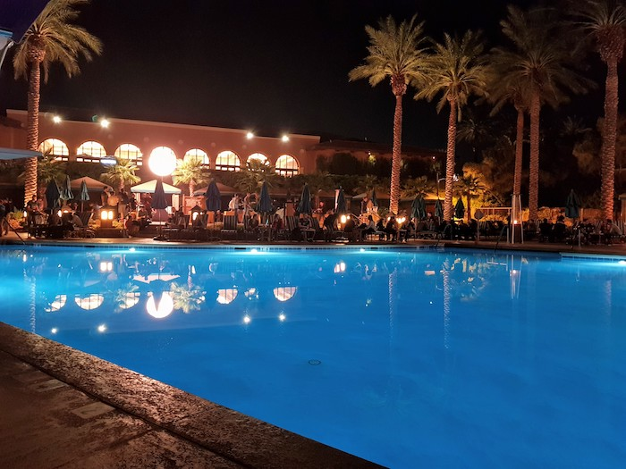

I have just come back to my hotel room after an exhausting (but awesome!) Day 1 of React Conf 2018, which is being held at Westin Lake Resort near Lake Las Vegas. It's been a great day listening to talks and meeting new people and I'm looking forward to Day 2. Here are some of my highlights so far:

- **React Hooks** - Sophie Alpert, Dan Abramov and Ryan Florence introduced the new [React Hooks API](https://reactjs.org/docs/hooks-intro.html) first thing this morning which I will be trying out as soon as I can. It looks like a clean solution for writing stateful components without needing to use a class and should help us with things like code reuse; avoiding "wrapper hell"; and testing component logic more easily.
- **PopMotion Pose** - Matt Perry told us about his declarative animation library Pose (which I've been meaning to try out for a while now) and the motivations behind it. I think I'll try using it first to animate the blog post cards on the home page of this site in a "staggered" fade-in, drop-down fashion.
- **Polyhedra Viewer** - Nat Allison gave an interesting talk and [super demo](https://polyhedra.tessera.li/) about Polyhedra and the site she has built with React to visualise the relationships between the convex, regular-faced polyhedra. Being able to animate between the various polyhedra interactively via the available transformations is pretty amazing.
- **9 Square in the Air** - This is a game I've only just heard of today - and it's awesome.

A few pictures I took since arriving yesterday:

Picked up my lanyard last night at the welcome registration.

View over the mountains flying into Las Vegas

Main stage.

A great game called 9 square in the air...Met some fun people playing this.

Pool party and dinner after
