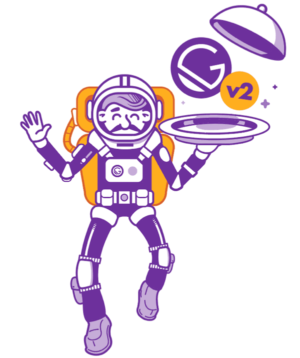

I've been getting the itch recently to revive this blog and I thought a good way to start was by updating it to use the recently launched version 2 of Gatsby. I did attempt to upgrade a few weeks ago during the beta which went... almost according to plan. Everything worked apart from images on the post pages - somehow they weren't being transformed correctly from the markdown files. But trying again when version 2 had launched fully solved the issue.

Version 2 of Gatsby has several benefits including updating to the latest versions of React, Webpack & Babel, switching to Reach Router from React Router for improved accessibility, smaller bundle sizes, faster site builds & seriously impressive hot reloading!

Next on the agenda for this site is to try to get 100s across the board (or as close as I can get!) in Lighthouse scores, which measure the site's performance, accessibility and user experience.
